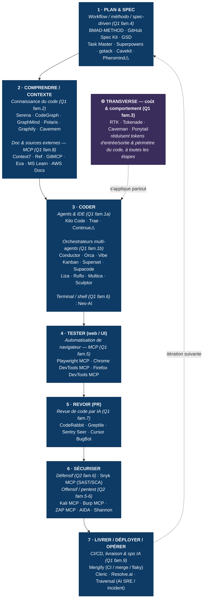

# SDLC × outils IA — quel outil pour quelle phase

> Vue de synthèse : les phases du cycle de vie logiciel (SDLC) et les outils IA du recensement mobilisables à chaque étape. Dérivé de [Q1 — produire du code](Q1%20-%20produire%20du%20code.md) (+ sécurité depuis [Q2](Q2%20-%20IA%20dans%20un%20produit.md)). Les **icônes de coût/licence** et la liste complète sont dans les tableaux par famille — ici on ne montre que le **mapping**.

## Mapping détaillé (vers les familles, pour les coûts & la liste complète)

| Phase SDLC | Famille(s) du recensement | Aller à |
|---|---|---|
| **1. Plan & spec** | Workflow / méthodo / spec-driven | [Q1 §4](Q1%20-%20produire%20du%20code.md#fam-4) |
| **2. Comprendre / contexte** | Connaissance du code · Doc & sources MCP | [Q1 §2](Q1%20-%20produire%20du%20code.md#fam-2) · [Q1 §8](Q1%20-%20produire%20du%20code.md#fam-8) |
| **3. Coder** | Agents & IDE · Orchestrateurs multi-agents · Terminal | [Q1 §1a](Q1%20-%20produire%20du%20code.md#fam-1a) · [§1b](Q1%20-%20produire%20du%20code.md#fam-1b) · [§6](Q1%20-%20produire%20du%20code.md#fam-6) |
| **4. Tester (web/UI)** | Automatisation de navigateur (MCP) | [Q1 §5](Q1%20-%20produire%20du%20code.md#fam-5) |
| **5. Revoir (PR)** | Revue de code par IA | [Q1 §7](Q1%20-%20produire%20du%20code.md#fam-7) |
| **6. Sécuriser** | Sécurité via MCP (offensif/défensif) · Pentest autonome | [Q2 §6](Q2%20-%20IA%20dans%20un%20produit.md#fam-6) · [Q2 §5](Q2%20-%20IA%20dans%20un%20produit.md#fam-5) |
| **7. Livrer / déployer / opérer** | CI/CD, livraison & ops IA · *(+ LLMOps si produit LLM)* | [Q1 §9](Q1%20-%20produire%20du%20code.md#fam-9) · [Q2 §8](Q2%20-%20IA%20dans%20un%20produit.md#fam-8) |
| **Transverse** | Optimisation tokens & comportement | [Q1 §3](Q1%20-%20produire%20du%20code.md#fam-3) |

## Notes honnêtes
- **Phase 7 (livrer / déployer / opérer)** : désormais couverte par la **famille Q1.9** — CI/merge/flaky (**Mergify**) et **AI SRE / incident** (**Cleric · Resolve.ai · Traversal**). Réserves assumées : les AI SRE sont des **SaaS propriétaires enterprise / sur devis** (LLM inclus 📦) et le volet ops **déborde vers « exploiter un produit »** (frontière Q2) ; l'observabilité LLM (Langfuse, Helicone… Q2 fam.8) reste distincte (produit qui embarque un LLM, pas déploiement de code). Le CI-AI le plus « agent » (Datadog Bits AI Dev Agent, Aviator, Trunk) reste en **candidats non vérifiés**.
- **Outils exclus du diagramme car dépréciés** (encore dans les tableaux, avec ⚠️) : **Puppeteer MCP** (archivé), **Crystal** (→ Nimbalyst). **Continue** (⚠️ racheté par Cursor) et **Pheromind** (⚠️ statut flou) gardés mais marqués.
- Le SDLC est **itératif** (la flèche 7→1) : la plupart de ces outils servent à chaque tour de boucle, pas une seule fois.
- Beaucoup d'outils sont **multi-phases** (un agent comme Kilo aide aussi à comprendre/tester) ; ils sont rangés ici à leur **usage principal**.

*(synthèse générée le 2026-06-18 à partir des tableaux Q1/Q2 ; re-générer si les familles évoluent.)*
