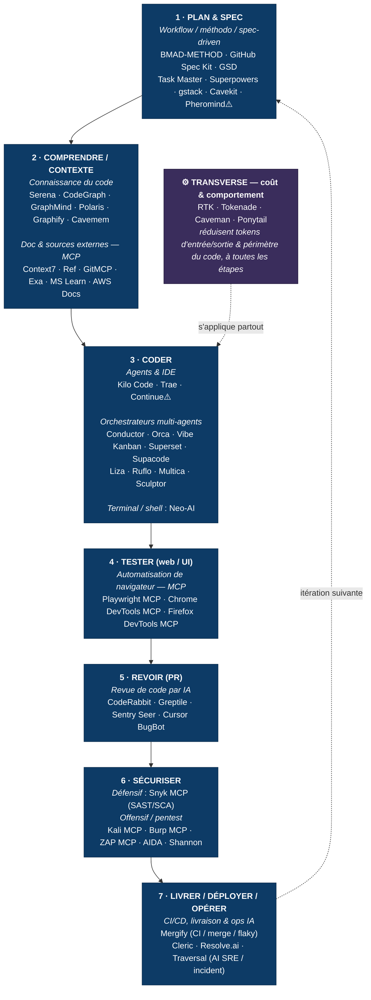

# SDLC × outils IA — quel outil pour quelle phase

> Vue de synthèse : les phases du cycle de vie logiciel (SDLC) et les outils IA du recensement mobilisables à chaque étape. Dérivé de [produire du code](guides/generer-du-code-avec-l-ia.md) (+ sécurité depuis [Embarquer l'IA dans un produit](guides/mettre-de-l-ia-en-production.md)). Les **icônes de coût/licence** et la liste complète sont dans les tableaux par famille — ici on ne montre que le **mapping**.

## Mapping détaillé (vers les familles, pour les coûts & la liste complète)

| Phase SDLC | Familles d'outils (cliquer → tableau complet + coûts) |
|---|---|
| **1. Plan & spec** | [Workflow / méthodo / spec-driven](guides/generer-du-code-avec-l-ia.md#fam-workflow-methodologie-developpement-spec-driven) |
| **2. Comprendre / contexte** | [Connaissance du code](guides/generer-du-code-avec-l-ia.md#fam-connaissance-du-code-graphes-recherche-memoire) · [Doc & sources MCP](guides/generer-du-code-avec-l-ia.md#fam-documentation-sources-de-connaissances-externes-serveurs-mcp) |
| **3. Coder** | [Agents & IDE](guides/generer-du-code-avec-l-ia.md#fam-agents-ide-qui-codent) · [Orchestrateurs multi-agents](guides/generer-du-code-avec-l-ia.md#fam-orchestrateurs-systemes-multi-agents-de-codage) · [Terminal / shell](guides/generer-du-code-avec-l-ia.md#fam-assistants-ia-pour-terminal-shell) |
| **4. Tester (web/UI)** | [Automatisation de navigateur (MCP)](guides/generer-du-code-avec-l-ia.md#fam-automatisation-de-navigateur-serveurs-mcp) |
| **5. Revoir (PR)** | [Revue de code par IA](guides/generer-du-code-avec-l-ia.md#fam-revue-de-code-par-ia) |
| **6. Sécuriser** | [Sécurité via MCP](guides/mettre-de-l-ia-en-production.md#fam-securite-outils-exposes-via-mcp) · [Agents pentest](guides/mettre-de-l-ia-en-production.md#fam-agents-autonomes-specialises-par-domaine) |
| **7. Livrer / déployer / opérer** | [CI/CD, livraison & ops IA](guides/generer-du-code-avec-l-ia.md#fam-ci-cd-livraison-operations-assistes-par-ia) · [LLMOps](guides/fiabiliser-evaluer-un-systeme-llm.md#fam-llmops-evaluation-observabilite) *(si produit LLM)* |
| **Transverse** | [Optimisation tokens & comportement](guides/maitriser-le-cout-en-tokens.md#fam-optimisation-des-tokens-du-comportement-de-l-agent) |

## Notes honnêtes
- **Phase 7 (livrer / déployer / opérer)** : désormais couverte par la famille [CI/CD, livraison & ops IA](guides/generer-du-code-avec-l-ia.md#fam-ci-cd-livraison-operations-assistes-par-ia) — CI/merge/flaky (**Mergify**) et **AI SRE / incident** (**Cleric · Resolve.ai · Traversal**). Réserves assumées : les AI SRE sont des **SaaS propriétaires enterprise / sur devis** (LLM inclus 📦) et le volet ops **déborde vers « exploiter un produit »** (frontière avec *embarquer l'IA dans un produit*) ; l'[observabilité LLM](guides/fiabiliser-evaluer-un-systeme-llm.md#fam-llmops-evaluation-observabilite) (Langfuse, Helicone…) reste distincte (produit qui embarque un LLM, pas déploiement de code). Le CI-AI le plus « agent » (Datadog Bits AI Dev Agent, Aviator, Trunk) reste en **candidats non vérifiés**.
- **Outils exclus du diagramme car dépréciés** (encore dans les tableaux, avec ⚠️) : **Puppeteer MCP** (archivé), **Crystal** (→ Nimbalyst). **Continue** (⚠️ racheté par Cursor) et **Pheromind** (⚠️ statut flou) gardés mais marqués.
- Le SDLC est **itératif** (la flèche 7→1) : la plupart de ces outils servent à chaque tour de boucle, pas une seule fois.
- Beaucoup d'outils sont **multi-phases** (un agent comme Kilo aide aussi à comprendre/tester) ; ils sont rangés ici à leur **usage principal**.

*(synthèse générée le 2026-06-18 à partir des tableaux par domaine ; re-générer si les familles évoluent.)*
