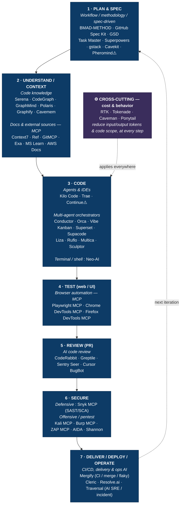

# SDLC × AI tools — which tool for which phase

> Synthesis view: the phases of the software development life cycle (SDLC) and the census's AI tools usable at each step. Derived from [generating code](guides/generate-code-with-ai.md) (+ security from [Embedding AI in a product](guides/ai-in-production.md)). The **cost/license icons** and the full list are in the per-family tables — here we only show the **mapping**.

## Detailed mapping (to families, for costs & the full list)

| SDLC phase | Tool families (click → full table + costs) |
|---|---|
| **1. Plan & spec** | [Workflow / methodology / spec-driven](guides/generate-code-with-ai.md#fam-workflow-methodology-spec-driven-development) |
| **2. Understand / context** | [Code knowledge](guides/generate-code-with-ai.md#fam-codebase-knowledge-graphs-search-memory) · [Docs & MCP sources](guides/generate-code-with-ai.md#fam-documentation-external-knowledge-sources-mcp-servers) |
| **3. Code** | [Agents & IDEs](guides/generate-code-with-ai.md#fam-coding-agents-ides) · [Multi-agent orchestrators](guides/generate-code-with-ai.md#fam-coding-orchestrators-multi-agent-systems) · [Terminal / shell](guides/generate-code-with-ai.md#fam-ai-assistants-for-terminal-shell) |
| **4. Test (web/UI)** | [Browser automation (MCP)](guides/generate-code-with-ai.md#fam-browser-automation-mcp-servers) |
| **5. Review (PR)** | [AI code review](guides/generate-code-with-ai.md#fam-ai-code-review) |
| **6. Secure** | [Security via MCP](guides/ai-in-production.md#fam-security-tools-exposed-via-mcp) · [Pentest agents](guides/ai-in-production.md#fam-domain-specialized-autonomous-agents) |
| **7. Deliver / deploy / operate** | [CI/CD, delivery & ops AI](guides/generate-code-with-ai.md#fam-ci-cd-delivery-ai-assisted-operations) · [LLMOps](guides/build-reliable-llm-systems.md#fam-llmops-evaluation-observability) *(if LLM product)* |
| **Cross-cutting** | [Token & behavior optimization](guides/control-token-cost.md#fam-token-agent-behavior-optimization) |

## Honest notes
- **Phase 7 (deliver / deploy / operate)**: now covered by the [CI/CD, delivery & ops AI](guides/generate-code-with-ai.md#fam-ci-cd-delivery-ai-assisted-operations) family — CI/merge/flaky (**Mergify**) and **AI SRE / incident** (**Cleric · Resolve.ai · Traversal**). Acknowledged caveats: AI SREs are **proprietary enterprise SaaS / quote-based** (LLM included 📦) and the ops aspect **spills over into "operating a product"** (boundary with *embedding AI in a product*); [LLM observability](guides/build-reliable-llm-systems.md#fam-llmops-evaluation-observability) (Langfuse, Helicone…) remains distinct (a product that embeds an LLM, not code deployment). The most "agent" CI-AI (Datadog Bits AI Dev Agent, Aviator, Trunk) remains in **unverified candidates**.
- **Tools excluded from the diagram because deprecated** (still in the tables, with ⚠️): **Puppeteer MCP** (archived), **Crystal** (→ Nimbalyst). **Continue** (⚠️ acquired by Cursor) and **Pheromind** (⚠️ unclear status) kept but flagged.
- The SDLC is **iterative** (the 7→1 arrow): most of these tools serve on each pass of the loop, not just once.
- Many tools are **multi-phase** (an agent like Kilo also helps with understanding/testing); they are placed here at their **primary use**.

*(synthesis generated on 2026-06-18 from the per-domain tables; regenerate if the families change.)*
